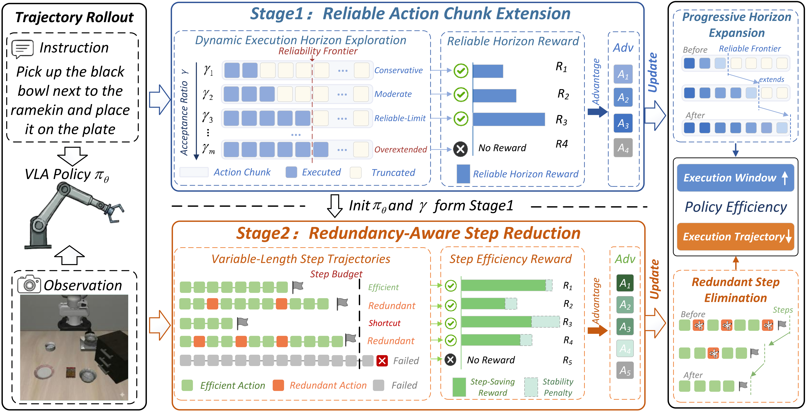

<div align="center">
  <h1>PolicyTrim: Boosting Intrinsic Policy Efficiency of Vision-Language-Action Models</h1>
</div>

<div align="center">

[](README.md)
[](README.zh-CN.md)

</div>

## 项目概述

本仓库提供论文 **PolicyTrim: Boosting Intrinsic Policy Efficiency of Vision-Language-Action Models** 的实现。

PolicyTrim 面向 VLA 模型在长时域动作生成与真实部署中的策略效率瓶颈，基于 GRPO 构建两阶段强化学习后训练框架：

- **阶段一：长时域可靠执行能力扩展**
  通过动态执行时域探索与可靠时域奖励，逐步扩展策略可稳定执行的长动作块长度。
- **阶段二：执行路径压缩与稳定优化**
  结合步数节省奖励与组锚定时域稳定性正则，在 KL 约束下压缩冗余执行步数，并提升策略更新稳定性。

从策略学习层面，PolicyTrim 系统性缓解了长动作块尾部退化以及执行路径冗余问题。

<div align="center">
  
</div>

## 仓库内容

本项目基于 RLinf 的具身强化学习训练框架实现，当前主要包含：

- 面向 OpenPI、OpenVLA-OFT、GR00T 等 VLA 模型的具身 GRPO 后训练
- 长时域计划生成、分块执行与 re-planning 感知 rollout
- 计划时域奖励、步数节省奖励、时域稳定性正则
- LIBERO、ManiSkill、RoboTwin、RoboCasa、MetaWorld 等具身任务配置与脚本

## 方法核心

### 1. 长时域可靠动作块扩展

PolicyTrim 不仅训练策略完成任务，还显式推动策略从短动作块逐步过渡到更长且更可靠的动作块执行。训练中支持先生成更长规划，再按固定 chunk 与环境交互。

### 2. 策略内在效率优化

PolicyTrim 优化的不是单纯的任务成功率，还包括“以更少的执行步数更早完成任务”的能力。成功越早，获得的效率奖励越高，从而压缩冗余执行轨迹。

### 3. 组级时域稳定性正则

为降低长时域训练中的更新不稳定和尾部退化，PolicyTrim 在 GRPO 组内引入基于成功时间分布的稳定性约束，提高具身 VLA 后训练的鲁棒性。

## 两阶段训练流程

PolicyTrim 使用两阶段训练流程。

### 阶段一：Reliable Action Chunk Extension

阶段一 **Reliable Action Chunk Extension** 的目标是拓展策略能够稳定执行的最长动作块时域。训练会从较短 chunk 出发，逐步探索更长的规划时域，使策略在更长时间窗口内保持可靠执行能力。

阶段一建议参数设置：

- 开启可靠时域奖励：`algorithm.use_plan_reward=True`
- 关闭步数节省奖励：`algorithm.use_eff_reward=False`
- 这一阶段通常关闭时域稳定性惩罚：`algorithm.use_temporal_stability_penalty=False`
- 设置更大的规划时域并进行时域探索：
  `rollout.plan_horizon=<目标 horizon>`
  `rollout.action_horizons_pattern=[短时域,...,目标时域]`
- 执行 chunk 大小保持固定：
  `actor.model.num_action_chunks=<基础 chunk>`

阶段一的典型效果：

- 模型先学会执行更长且更可靠的动作计划
- 选择阶段一中表现最优、最稳定的 chunk / horizon 设置，作为阶段二的基础

### 阶段二：Redundancy-Aware Step Reduction

阶段二 **Redundancy-Aware Step Reduction** 建立在阶段一选出的最优 chunk 设置之上。这个阶段的目标不再是继续拓展 chunk，而是在保持成功率稳定的前提下减少冗余执行步数。

阶段二建议参数设置：

- 关闭可靠时域奖励：`algorithm.use_plan_reward=False`
- 开启步数节省奖励：`algorithm.use_eff_reward=True`
- 开启时域稳定性正则：
  `algorithm.use_temporal_stability_penalty=True`
- 设置效率奖励的步数上限：
  `algorithm.eff_max_step=<任务相关的最大步数>`
- 固定阶段一选出的最佳 chunk / horizon 设置：
  `actor.model.num_action_chunks=<阶段一最优 chunk>`
  `rollout.plan_horizon=<选出的最佳 horizon>`
  `rollout.action_horizons_pattern=[最佳 horizon]` 或更窄的固定模式

阶段二的典型效果：

- 策略被优化为以更少步数完成任务
- 冗余执行路径被压缩
- 在组相对时域稳定性正则下，GRPO 更新更加稳定

## 代码结构

- `examples/embodiment/config/`：训练与评测配置
- `examples/embodiment/run_embodiment.sh`：具身训练入口
- `rlinf/workers/rollout/hf/huggingface_worker.py`：长时域 rollout 与 plan cache 逻辑
- `rlinf/workers/actor/fsdp_actor_worker.py`：GRPO 优势计算与 actor 训练
- `rlinf/algorithms/utils.py`：效率奖励、计划奖励、时域稳定性惩罚
- `rlinf/models/embodiment/`：各类 VLA 模型实现

## 安装

### 使用 uv 环境安装

本仓库已经内置基于 `uv` 的安装脚本，推荐直接使用 `requirements/install.sh` 创建环境并安装依赖。

1. 安装 `uv`

```bash
curl -LsSf https://astral.sh/uv/install.sh | sh
source ~/.local/bin/env
```

如果系统里已经有 `uv`，可跳过这一步。

2. 创建并安装具身训练环境

例如，为 OpenPI + ManiSkill/LIBERO 相关实验创建独立环境：

```bash
bash requirements/install.sh embodied --model openpi --env maniskill_libero --venv openpi-venv
```

例如，为 OpenVLA-OFT 创建环境：

```bash
bash requirements/install.sh embodied --model openvla-oft --env maniskill_libero --venv openvla-oft-venv
```

例如，为 GR00T 创建环境：

```bash
bash requirements/install.sh embodied --model gr00t --env maniskill_libero --venv gr00t-venv
```

3. 激活环境

```bash
source .venv/openpi-venv/bin/activate
```

如果你传入的是其他 `--venv` 名称，请替换成对应目录。

4. 环境变量

根据所用模型、模拟器和数据资产，通常还需要配置：

- `REPO_PATH`
- `EMBODIED_PATH`
- 各类模型权重路径
- 各环境数据集或资产路径
- 某些环境所需变量，例如 `MUJOCO_GL=egl`

## 快速开始

### 1. 训练

具身训练入口如下：

```bash
bash examples/embodiment/run_embodiment.sh <config_name>
```

PolicyTrim 相关配置主要位于：

```bash
examples/embodiment/config/*grpo*.yaml
```

### 2. 评测

使用以下脚本进行具身评测：

```bash
bash examples/embodiment/eval_embodiment.sh <config_name>
```

## 方法与代码配置的对应关系

PolicyTrim 的主要机制在代码中对应为：

- **动态规划时域 / 重规划模式**
  由 `rollout.plan_horizon` 与 `rollout.action_horizons_pattern` 控制
- **可靠时域奖励**
  由 `algorithm.use_plan_reward` 控制
- **步数节省奖励**
  由 `algorithm.use_eff_reward` 控制
- **组锚定时域稳定性正则**
  由 `algorithm.use_temporal_stability_penalty` 控制

## Citation and Acknowledgement

If you find RLinf helpful, please cite the paper:

```bibtex
@article{yu2025rlinf,
  title={RLinf: Flexible and Efficient Large-scale Reinforcement Learning via Macro-to-Micro Flow Transformation},
  author={Yu, Chao and Wang, Yuanqing and Guo, Zhen and Lin, Hao and Xu, Si and Zang, Hongzhi and Zhang, Quanlu and Wu, Yongji and Zhu, Chunyang and Hu, Junhao and others},
  journal={arXiv preprint arXiv:2509.15965},
  year={2025}
}
```
